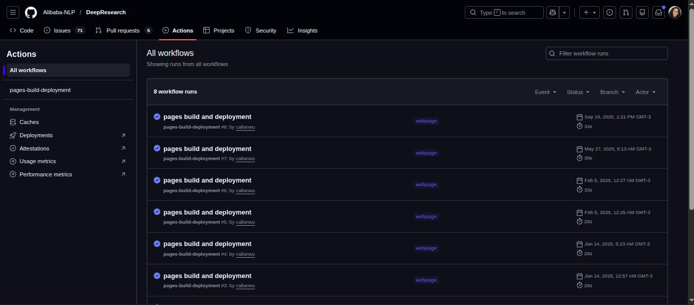
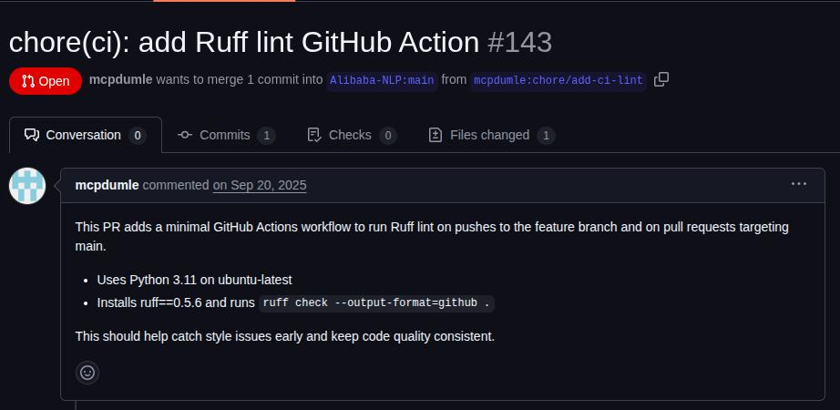

# 📘 Análise da Automação CI/CD do DeepResearch
## Equipe 1 - DeepResearch
| Nome                              | Matrícula     | Descrição da atividade                                                                                   |
|----------------------------------|---------------|-----------------------------------------------------------------------------------------------------------|
| Álex Santos Alencar              | 202300061518  | Diagnóstico e análise do fluxo atual de desenvolvimento.                      |
| Ellen Karolliny dos Santos       | 202300114326  | Definição de automação e seus tipos.                           |
| Gabriel Luiz Santos Gama Barreto | 202300114335  | Diagnóstico e análise de automação no repositório do DeepResearch. |
| Gabriel Ramos de Carvalho        | 202300061920  | Diagnóstico e análise dos riscos de regressão do projeto.                  |
| João Andryel Santos Menezes      | 202300061652  | Diagnóstico e análise de automação no repositório.              |
| Larissa Batista dos Santos       | 202300061705  | Diagnóstico e análise de automação no repositório.            |
| Paloma dos Santos                | 202300061723  | Diagnóstico e análise dos gargalos manuais e limitações operacionais.                 |
| Rauany Ingrid Santos de Jesus    | 202300061760  | A importância e as vantagens da automação e organização do documento de entrega.  |

### DeepResearch - https://github.com/Alibaba-NLP/DeepResearch (Repositório do modelo analisado)

## Vídeo de apresentação dos resultados e síntese do projeto
### [Acessar vídeo](https://drive.google.com/file/d/16-FSiWnY2sPF4_BGmUp_7IoLqNMQBNzv/view?usp=drivesdk) 

## 📚 Sobre o Tutorial
---
Este tutorial apresenta como objetivo demonstrar o processo de análise e mapeamento de automações no Projeto DeepResearch a partir de seu repositório no github, utilizando sua branch principal e abas auxiliares como meios de verificação.
---

## 1. Investigação e Evidências

### 1.1 Diagnóstico Geral sobre a Automação

Ao analisar o repositório do Deep Research, foi observado que não existe uma verificação automática para encontrar erros no código. A pasta que normalmente guarda essas instruções (.github/workflows no Github Actions) não foi encontrada e nenhum arquivo .yml responsável por processos de Integração Contínua (CI) responsável por testes, lints e validações, nem de Implantação Contínua (CD) como deploys e correções automáticas no código fonte. Isso significa que, quando um programador faz uma alteração, não há um "robô" que testa as modificações sozinho para dizer se está certo ou errado. A garantia de que o código funciona vem dos testes manuais feitos pelos próprios desenvolvedores.

### 1.2. Atualização Automática do Site

Apesar da ausência de testes para o código principal, foi identificado no github actions um fluxo de Implantação Contínua (CD) chamado pages-build-deployment. A função dele é exclusiva para a documentação. Sempre que os manuais ou textos explicativos são alterados, o sistema atualiza sozinho o site oficial do projeto. O benefício direto é manter as instruções de uso sempre em dia para o público, sem que a equipe precise fazer essa atualização manualmente.

  

### 1.3. Automação do Ambiente Local

Mesmo sem automação configurada no repositório, detectou-se uma ferramenta para organizar o ambiente local: o arquivo run_react_infer.sh. Ele foi identificado como a peça principal de engenharia do projeto. Esse script substitui as configurações manuais difíceis, pois prepara o ambiente, baixa o que é necessário e coloca a inteligência artificial para rodar. Basicamente, ele serve para garantir que o programa funcione da mesma maneira no computador de qualquer pessoa que baixar o projeto.

### 1.4. Análise dos Pull Requests

A análise do histórico de pull requests confirmou o pensamento inicial. Não foram encontradas validações automáticas de testes nas aprovações de código. No entanto dentre as solicitações pendentes se destacou o Pull Request #143, que traz uma proposta para adicionar uma ferramenta de verificação automática (Linter). A existência desse pedido externo corrobora o fato de que o projeto não possui sistemas nativos para filtrar erros de código. Essa ferramenta atuaria como um filtro de qualidade técnica, mas, como ainda não foi implementada, o processo continua sem automação.

  

## 2. Fluxo, Riscos e Gargalos

### 2.1 Fluxo de Desenvolvimento

Atualmente, o fluxo é focado na publicação de resultados e execução local, seguindo estes passos:

​Codificação: O desenvolvedor realiza alterações nos scripts de pesquisa ou na lógica do agente (deep_research/).

​Validação de Ambiente: O desenvolvedor utiliza o script run_react_infer.sh para configurar o ambiente e validar se o modelo de inferência está rodando corretamente na máquina local.

​Submissão (Pull Request): O código é enviado para o GitHub.

​Integração de Documentação: Se houver alteração na documentação, o workflow pages-build-deployment é acionado automaticamente para atualizar o site do projeto.

​Merge: O código é integrado à branch principal sem passar por baterias de testes automatizados no servidor.

### 2.2 Riscos de Regressão

Um dos riscos identificados é a Regressão de Desempenho do Modelo (Model Drift), onde o agente não necessariamente trava, mas se torna 'menos inteligente'. Pequenas refatorações no código podem alterar a forma como o contexto é processado ou truncado, levando a alucinações e falhas na resolução de problemas.

Por fim, a Regressão Funcional de Ferramentas expõe que a comunicação, realizada via troca de strings ou JSON, carece de contratos de interface fortes; consequentemente, se uma ferramenta externa alterar o formato de sua resposta, o agente perderá a capacidade de processar a informação corretamente.

### 2.3 Gargalos Manuais e Limitações Operacionais

A inovação algorítmica do projeto está à frente de sua maturidade operacional, gerando diversas barreiras manuais.

Dependência de Code Review (Gargalo Humano): A validação da lógica e da segurança recai quase totalmente sobre a revisão humana, criando um gargalo onde PRs se acumulam aguardando a atenção limitada dos especialistas.

Configuração de Ambiente (Onboarding): O processo de setup é manual (Conda) e não padronizado via Docker, levando a problemas recorrentes de "funciona na minha máquina" e dificultando a entrada de novos desenvolvedores.

Gestão de Credenciais e Testes: O projeto não roda "offline" e depende de chaves de API (caras e sensíveis). Como o GitHub Actions não pode acessar segredos de forks externos, contribuidores não conseguem rodar testes de integração no CI, postergando a validação real para o mantenedor.

Benchmarking Manual: A avaliação da qualidade do modelo (se ele ficou mais ou menos preciso) é feita através da execução manual de scripts locais, desconectada do fluxo de CI. Isso faz com que decisões de merge sejam tomadas "às cegas" em relação ao impacto na qualidade cognitiva.

Limitação de Hardware: A exigência de GPUs de classe servidor para rodar o modelo localmente impede que desenvolvedores individuais contribuam com mudanças profundas na lógica, restringindo a comunidade a correções superficiais.

## 📄 Documentação da análise dos LLMs

Acesse a versão em PDF contendo:

- Introdução ao tema
- Tutorial
- A análise detalhada
- Conclusões estruturadas
- Referências

### [Acessar documento](docs/ESII-analise-Atividade3_parte1.pdf) 
